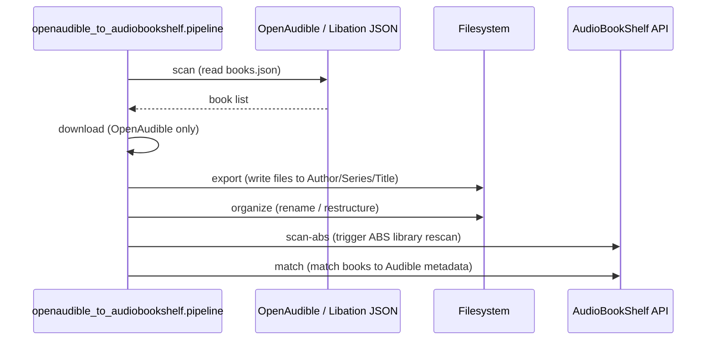
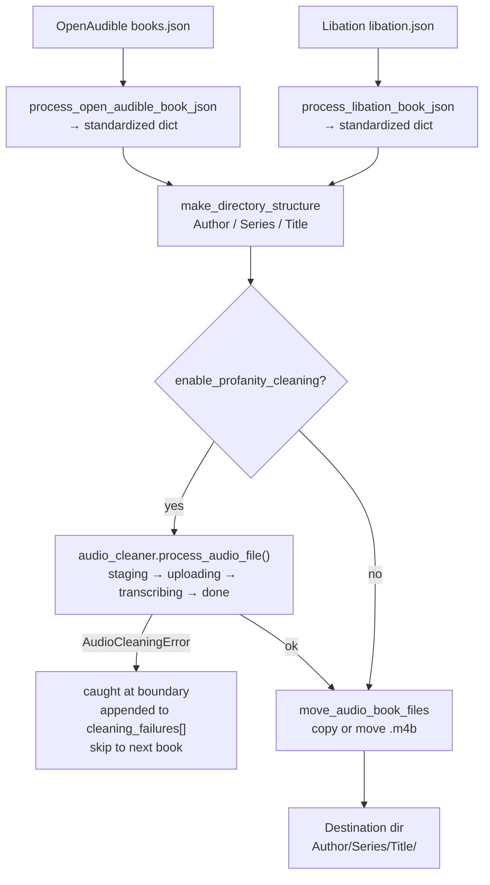
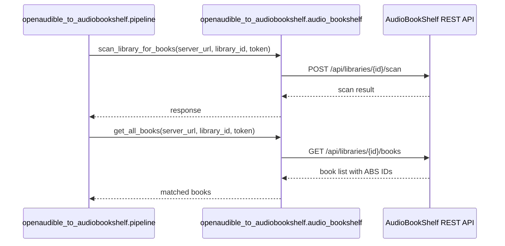
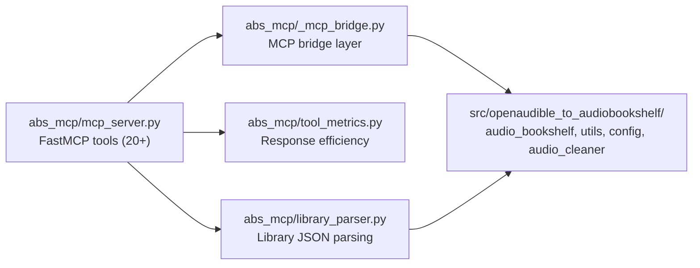
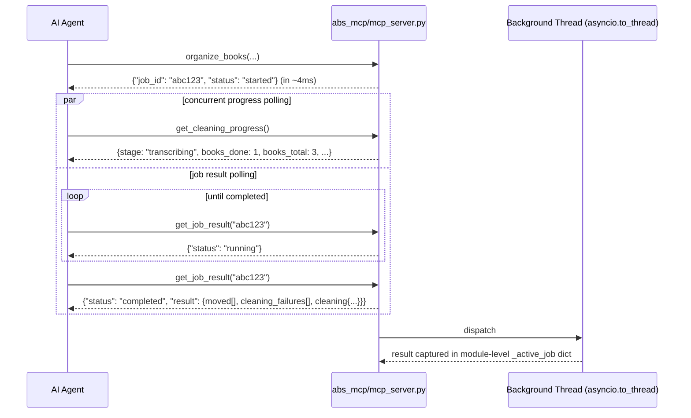

# CODEFLOW.md

## Table of Contents

1. [End-to-End Pipeline](#1-end-to-end-pipeline)
2. [Export and Organize](#2-export-and-organize)
3. [AudioBookShelf Integration](#3-audiobookshelf-integration)
4. [MCP Bridge](#4-mcp-bridge)
5. [Key Modules](#5-key-modules)

---

## 1. End-to-End Pipeline

The CLI `openaudible-to-abs` (via `pipeline.py`) dispatches to discrete steps. `VALID_STEPS` defines the full sequence.

Pipeline steps: `scan` → `download` → `export` → `organize` → `scan-abs` → `match`

---

## 2. Export and Organize

`process_open_audible_book_json` and `process_libation_book_json` normalize book metadata into a common format, then `move_audio_book_files` / `make_directory_structure` write to the filesystem. When `enable_profanity_cleaning=true`, `move_audio_book_files` calls `audio_cleaner.process_audio_file()` on each book first; failures raise `AudioCleaningError`, are caught at the per-book boundary, and recorded in `cleaning_failures[]`.

OpenAudible and Libation have different JSON schemas -- the two `process_*` functions map each to the same internal dict shape.

---

## 3. AudioBookShelf Integration

ABS API calls are in `src/openaudible_to_audiobookshelf/audio_bookshelf.py`. After files exist on disk, `scan-abs` triggers an ABS library rescan and `match` matches books to Audible metadata.

---

## 4. MCP Bridge

The `abs_mcp/mcp_server.py` FastMCP server exposes 20+ pipeline tools for AI agents. It imports `openaudible_to_audiobookshelf.*` modules and the abs_mcp helper modules (`_mcp_bridge.py`, `library_parser.py`, `tool_metrics.py`) directly. For the full tool list with parameters, see [abs_mcp/README.md](../abs_mcp/README.md).

Tool categories:

- **Discovery & status:** `list_libraries`, `get_status`, `list_library`, `list_abs_library`, `search_abs_library`, `get_source_status`
- **Ingestion pipeline:** `scan_audible`, `download_books`, `export_library`, `organize_books`, `scan_audiobookshelf`, `match_audiobookshelf`, `ingest_books`, `set_book_status`
- **Library management:** `delete_library_items`
- **Podcasts:** `search_podcasts`, `add_podcast`, `list_podcasts`, `get_podcast_episodes`, `download_podcast_episodes`, `fetch_podcast_feed`, `download_podcast_files`
- **Metrics:** `get_tool_metrics`, `query_tool_metrics_history`
- **Profanity cleaning:** `get_cleaning_progress` (per-book stage + counters), `get_job_result` (final async job payload — DR-6)

### Async job pattern (DR-6)

`organize_books` and `ingest_books` are async MCP tools:

The single-slot guard makes a second concurrent `organize_books` return `{"error": "Job already running", "active_job_id": "..."}`. If the server restarts mid-job, `get_job_result` returns `{"error": "Unknown job"}` and the caller should re-invoke `organize_books`.

MCP server supports Libation only (not OpenAudible). For Docker deployment (combined Libation + MCP image), see [abs_mcp/README.md](../abs_mcp/README.md) "Docker Deployment" section.

---

## 5. Key Modules

| Module | Role |
|--------|------|
| `src/openaudible_to_audiobookshelf/pipeline.py` | CLI entry, step dispatch, process_*_book_json normalizers |
| `src/openaudible_to_audiobookshelf/config.py` | Argparse + YAML config, all CLI flags |
| `src/openaudible_to_audiobookshelf/audio_bookshelf.py` | ABS REST client: scan, list, match |
| `src/openaudible_to_audiobookshelf/audio_cleaner.py` | Post-processing / profanity cleaning |
| `src/openaudible_to_audiobookshelf/utils.py` | Path helpers, libation export, directory structure |
| `src/openaudible_to_audiobookshelf/search_ai.py` | Optional AI-assisted search |
| `abs_mcp/mcp_server.py` | FastMCP server with 20+ pipeline tools |
| `abs_mcp/_mcp_bridge.py` | Bridge layer between FastMCP tool wrappers and the parent package |
| `abs_mcp/tool_metrics.py` | Response efficiency tracking (in-memory + JSONL persistence) |
| `abs_mcp/library_parser.py` | Library metadata parsing for MCP tools |

## Test Coverage

| Test area | Location |
|-----------|---------|
| Config / argparse | `tests/` |
| ABS client | `tests/` |
| Libation processing | `tests/` |
| Audio cleaner | `tests/` |
| MCP server | `tests/` |

Run with: `pytest tests/ -v`
